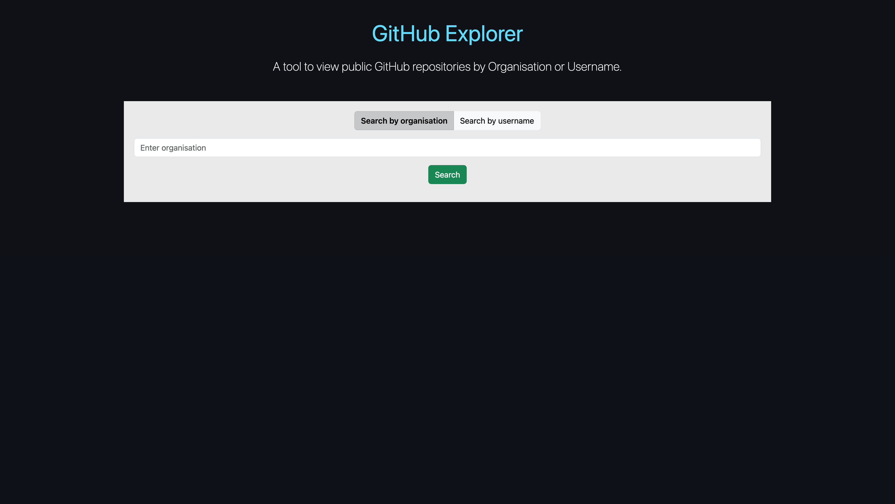
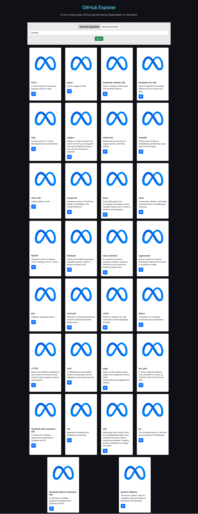

# GitHub Search Application

## User Story

As a user I should be able to search for information using the GitHub API.

## Acceptance Criteria

- User should be able to search for repositories for a valid organisation `https://api.github.com/orgs/{organisationName}/repos`
- User should be able to search for repositories for a valid GitHub username `https://api.github.com/users/{username}/repos`
- User is able to select either search by organisation name OR search by username. Use a radio button for this.
- If user selects search by organisation name then the label should read "Organisation" and placeholder should read "Please enter valid organisation"
- If user selects search by username name then the label should read "Username" and placeholder should read "Please enter valid username"
- Form should have validation where organisation name or github username is required
- Repositories should be presented as many cards keeping in mind responsive layouts
- Each repository must be presented as a card with the following information:
  - Repo name
  - Repo url
  - Description
  - User avatar
- If the number of repositories returned from the API is 0 then the user should be presented with an alert `"No repositories found."`

## Technical Criteria

- Use function based components
- Use the react hook `useState` and `useEffect`
- Use `axios`
- Ensure that the code follows semantic HTML structure
- Ensure that the code is well structured in to re-useable components
- Ensure the codebase follows the React files and folder structure
- Deploy the react application using [GitHub pages](https://github.com/gitname/react-gh-pages)

## Additional Resources

- You can use [Bootstrap 5](https://getbootstrap.com/docs/5.3/getting-started/introduction/) as your CSS framework
- You can choose a colour palette from [coolors](https://coolors.co/)
- You can import [font-awesome icons](https://fontawesome.com/icons) using the [CDN](https://cdnjs.com/libraries/font-awesome)
- Axios library [axios](https://www.npmjs.com/package/axios)

## Wireframe Guide

Please use this high level wireframe as a guide for your portfolio and you are free to choose your own colours and/or layout if needed.

TODO

## Example Application

### Initial Load

### Valid Search

